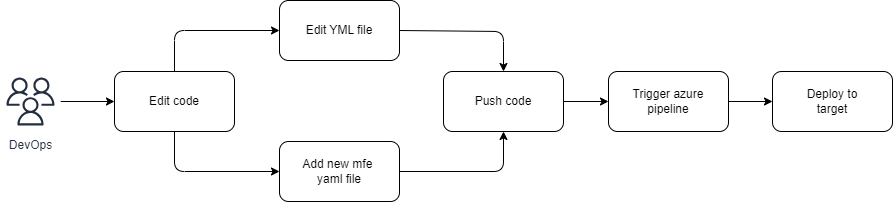

# Demo Microfront Angular 19 with Module Federate - Mono Repo approach (projects in one workspace)

This project uses Angular version 19.0.6 and NodeJS version 22.12.0.

We'll create the workspace.

```console
ng new affi-angular-challenge-workspace --create-application=false
```

Enter the workspace

```console
cd affi-angular-challenge-workspace
```

We will create the following projects:

## mfe-host

This project will be our microfrontend **container**.

```console
ng g application mfe-host --style=scss --routing=true
```

## mfe-auth

```console
ng g application mfe-auth --style=scss --routing=true
```

## Enabling module federation for Angular projects

The **@angular-architects/module-federation** package provides a custom generator. If you'd like to learn more about this library and Angular architecture, visit the following link:
<https://www.angulararchitects.io/en/aktuelles/the-microfrontend-revolution-module-federation-in-webpack-5/>

We add the library to each of the projects
Once the library is installed, we will add the use of Module Federation to our MF (microfrontends) and add some configurations:

```console
ng add @angular-architects/module-federation --project mfe-host --port 4200 --type host
ng add @angular-architects/module-federation --project mfe-auth --port 4201 --type remote
```

Commons lib (optional):

```console
ng g library commons-lib
```

We are require to modifiy commons lib path to add "projects" directory:

file **tsconfig.json**

```json
"paths": {
      "@commons-lib": ["./projects/commons-lib/src/public-api.ts"]
    },
```

We are require to create custom microfrontend declaration and add each remote module path name:
**projects\mfe-host\src\custom-mfe-decl.d.ts**

```javascript
declare module 'mfeAuth/*';
```

Okay, what this command will do is create some **webpack.config.js** files in each of our MFs to be able to use the module federation.

Then it's just a matter of configuring the **remote** and **host** MFs.

Example configuration for the auth MF:

```javascript
const { shareAll, withModuleFederationPlugin } = require('@angular-architects/module-federation/webpack');

module.exports = withModuleFederationPlugin({

  name: 'mfe-auth',

  exposes: {
    './AuthLogin': './projects/mfe-auth/src/app/auth/components/login/login.component.ts',
    './AuthRegister': './projects/mfe-auth/src/app/auth/components/register/register.component.ts',
  },

  shared: {
    ...shareAll({ singleton: true, strictVersion: true, requiredVersion: 'auto' }),
  },

  sharedMappings: ["@commons-lib"],

});
```

Example configuration for the host MF:

```javascript
const { shareAll, withModuleFederationPlugin } = require('@angular-architects/module-federation/webpack');

module.exports = withModuleFederationPlugin({

  name: 'mfe-host',

  remotes: {
    mfeAuth: "http://localhost:4201/remoteEntry.js",
  },

  shared: {
    ...shareAll({ singleton: true, strictVersion: true, requiredVersion: 'auto' }),
  },

  sharedMappings: ["@commons-lib"],

});

```

## Azure pipelines

The basic flow of working with pipelines:


There are 2 main stages:

1. Build — build the application, can run linting, tests, etc. Result here — artifacts with application to run or do deployment.
2. Deploy — place the application artifacts to hosted location.

There are different concepts inside but very short:

- pipeline can contain stages
- stages can be executed one by one
- stage can depends on previous stage(-s)
- each stage can contain jobs
- jobs can be executed in parallel
- each job can contain steps
- step is the basic operation to do (like install packages, build, publish, etc.)
- step is the task from the list of available tasks with parameters


## Development server

To start a local development server, run:

```bash
ng serve
```

Once the server is running, open your browser and navigate to `http://localhost:4200/`. The application will automatically reload whenever you modify any of the source files.

## Code scaffolding

Angular CLI includes powerful code scaffolding tools. To generate a new component, run:

```bash
ng generate component component-name
```

For a complete list of available schematics (such as `components`, `directives`, or `pipes`), run:

```bash
ng generate --help
```

## Building

To build the project run:

```bash
ng build
```

This will compile your project and store the build artifacts in the `dist/` directory. By default, the production build optimizes your application for performance and speed.

## Running unit tests

To execute unit tests with the [Karma](https://karma-runner.github.io) test runner, use the following command:

```bash
ng test
```

## Running end-to-end tests

For end-to-end (e2e) testing, run:

```bash
ng e2e
```

Angular CLI does not come with an end-to-end testing framework by default. You can choose one that suits your needs.

## Additional Resources

For more information on using the Angular CLI, including detailed command references, visit the [Angular CLI Overview and Command Reference](https://angular.dev/tools/cli) page.
